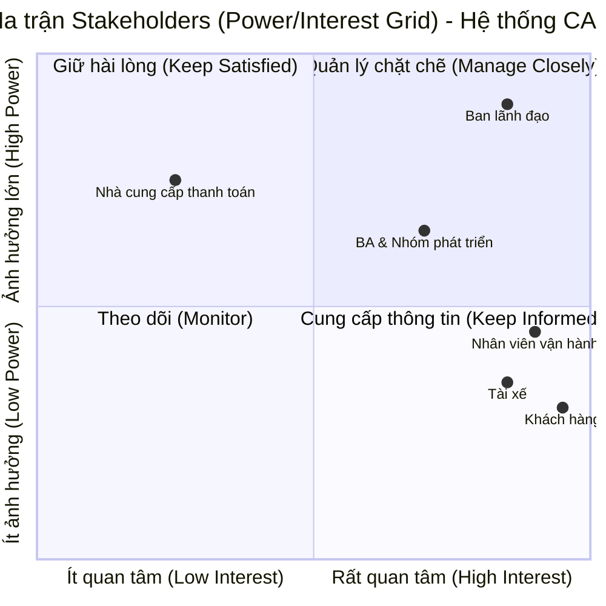

BƯỚC 1: đọc và phân tích yêu cầu ban đầu của KH ở giai đoạn sơ khởi  business contact 

---

---

## 1. Bối cảnh nghiệp vụ (Business Context)

### 1.1. Hiện trạng hệ thống (As-Is)

Công ty ABC hiện là một doanh nghiệp đang hoạt động trong lĩnh vực cung cấp dịch vụ đặt xe trực tuyến. Ở thời điểm hiện tại, quy trình đặt xe của khách hàng đang được xử lý thông qua hai kênh chính là liên hệ trực tiếp với tổng đài hoặc thông qua một ứng dụng cơ bản.

### 1.2. Các vấn đề đang gặp phải (Pain Points)

Hệ thống và quy trình vận hành hiện tại đang bộc lộ nhiều điểm hạn chế, cụ thể:

* **Vận hành kém hiệu quả:** Việc phân công tài xế chủ yếu vẫn đang được thực hiện thủ công.

* **Trải nghiệm khách hàng thấp:** Khách hàng gặp khó khăn trong việc theo dõi trạng thái chuyến đi của mình.

* **Quản lý rời rạc:** Dữ liệu và thông tin thanh toán chưa được quản lý một cách tập trung.

* **Rào cản kỹ thuật:** Bộ phận vận hành đang gặp rất nhiều khó khăn khi có nhu cầu mở rộng quy mô hệ thống.

### 1.3. Mục tiêu kinh doanh (Business Objectives / To-Be)

Để giải quyết các rào cản trên, ban lãnh đạo công ty ABC quyết định đầu tư xây dựng dự án hệ thống **CAB System** mới với thời gian triển khai dự kiến là 7 tuần. Mục tiêu cốt lõi của nền tảng mới bao gồm:

* **Nâng cao năng lực phục vụ:** Hệ thống phải có khả năng đáp ứng và phục vụ số lượng lớn khách hàng cùng tài xế, hoạt động ổn định ngay cả vào các thời điểm nhu cầu tăng cao.

* **Tự động hóa và minh bạch:** Xử lý luồng đặt xe tự động (tìm kiếm, phân công) và cho phép người dùng theo dõi toàn bộ trạng thái chuyến đi.

* **Kiến trúc linh hoạt:** Hệ thống không được sụp đổ toàn bộ nếu có một lỗi xảy ra ở chức năng thanh toán hay thông báo. Đồng thời, kiến trúc phải đủ linh hoạt để trong tương lai có thể bổ sung dịch vụ mới, thêm phương thức thanh toán hoặc các kênh thông báo mà không phải đập bỏ xây lại.

---

---

BƯỚC 2: xác định những stakeholders (lọc ra bảng gồm 2 cột, cột thứ nhất gồm tên stakeholders, cột thứ 2 là vai trò của nó) phần 2 là vẽ ma trận stakeholder matrix (ma trận này sẽ cho chúng ta biết tầm ảnh hưởng quan trọng của stakeholders trong hệ thống - dùng công cụ mermaid để vẽ các sơ đồ trong markdown)

### 1. Bảng xác định Stakeholders và Vai trò

Dựa vào yêu cầu ban đầu của doanh nghiệp, chúng ta có thể xác định các bên liên quan và vai trò của họ như sau:

| Tên Stakeholders | Vai trò |
| --- | --- |
| **Ban lãnh đạo / Ban giám đốc** | Là người tài trợ và đưa ra quyết định, mong muốn xây dựng nền tảng CAB mới có khả năng phục vụ số lượng lớn người dùng và có thể phát triển thêm tính năng trong tương lai.

 |
| **Khách hàng** | Là một trong ba nhóm người dùng chính, trực tiếp sử dụng ứng dụng để gửi yêu cầu đặt xe, theo dõi chuyến đi, thanh toán và đánh giá tài xế.

 |
| **Tài xế** | Là nhóm người dùng chính, sử dụng hệ thống để nhận thông báo chuyến, chấp nhận/từ chối, cập nhật trạng thái di chuyển và cung cấp dịch vụ vận chuyển.

 |
| **Nhân viên vận hành** | Là nhóm người dùng chính sử dụng giao diện quản trị để quản lý khách hàng, tài xế, chuyến đi, hỗ trợ xử lý chuyến bị lỗi và xem các báo cáo hiệu quả hoạt động.

 |
| **Business Analyst (BA)** | Người chịu trách nhiệm phân tích, xác định rõ phạm vi, tác nhân, quy trình nghiệp vụ và làm rõ các vấn đề còn chưa rõ với các bên liên quan.

 |
| **Nhóm phát triển** | Đội ngũ chịu trách nhiệm xây dựng giải pháp phần mềm dựa trên các yêu cầu đã được BA phân tích và chốt với khách hàng.

 |
| **Nhà cung cấp thanh toán bên ngoài** | Đối tác thứ ba được hệ thống tích hợp để xử lý các giao dịch thanh toán điện tử của khách hàng.

 |

---

### 2. Ma trận Stakeholder (Power/Interest Grid)

Ma trận này giúp định hình chiến lược giao tiếp và quản lý kỳ vọng. Các Stakeholder được phân loại dựa trên 2 trục: **Tầm ảnh hưởng (Power)** đến quyết định của dự án và **Sự quan tâm (Interest)** đối với kết quả của dự án.

Dưới đây là mã Mermaid để tạo biểu đồ Quadrant Chart (Ma trận phần tư). Khi dán vào GitHub Markdown, nó sẽ tự động render thành biểu đồ:

**Giải thích chiến lược quản lý dựa trên ma trận:**

1. **Góc phần tư 1 - Quản lý chặt chẽ (High Power, High Interest):**
* **Ban lãnh đạo:** Đây là nhóm tài trợ tiền và ra quyết định. BA cần liên tục báo cáo tiến độ, xin phê duyệt các yêu cầu và đảm bảo hệ thống đi đúng định hướng chiến lược.
* **BA & Nhóm phát triển:** Nhóm nòng cốt trực tiếp thiết kế và xây dựng, có ảnh hưởng lớn đến sự thành bại của giải pháp.

2. **Góc phần tư 2 - Giữ hài lòng (High Power, Low Interest):**
* **Nhà cung cấp thanh toán bên ngoài:** Họ không quan tâm đến nội bộ ứng dụng CAB vận hành ra sao, nhưng nếu API thanh toán của họ thay đổi hoặc gặp sự cố thì dự án bị ảnh hưởng rất nặng. Cần duy trì kênh liên lạc kỹ thuật để đảm bảo tích hợp thông suốt.

3. **Góc phần tư 4 - Cung cấp thông tin (Low Power, High Interest):**
* **Khách hàng, Tài xế, Nhân viên vận hành:** Đây là những người trực tiếp sử dụng hệ thống. Họ rất quan tâm vì ứng dụng ảnh hưởng đến công việc và tiện ích hàng ngày của họ. Tuy nhiên, họ không có quyền quyết định cấp vốn hay thay đổi phạm vi lõi của dự án. Cần khảo sát, lấy ý kiến (Requirement Gathering) và cung cấp tài liệu hướng dẫn sử dụng kỹ lưỡng. Mọi sự thay đổi trên ứng dụng đều phải thông báo trước cho nhóm này.

---

# Bước 3. Mục tiêu nghiệp vụ (Business Goals)

Dự án xây dựng nền tảng CAB System nhằm giải quyết các hạn chế của hệ thống hiện tại và hướng tới các mục tiêu chiến lược sau:

| ID | Tên Mục tiêu nghiệp vụ (Business Goal) | Mô tả chi tiết & Căn cứ (Rationale) |
| :--- | :--- | :--- |
| **BG01** | **Tự động hóa quy trình phân công và tìm kiếm tài xế** | Thay thế quy trình phân công thủ công hiện tại bằng cơ chế tự động. Hệ thống cần tự động xác định và ưu tiên các tài xế phù hợp dựa trên vị trí gần khách hàng, trạng thái sẵn sàng và các tiêu chí vận hành khác. Cần có cơ chế chuyển tiếp tìm tài xế khác nếu tài xế đầu tiên từ chối mà không yêu cầu khách tạo lại chuyến. |
| **BG02** | **Đa dạng hóa và quản lý tập trung phương thức thanh toán** | Khắc phục tình trạng thông tin thanh toán chưa được quản lý tập trung. Hệ thống cần hỗ trợ tính cước và cho phép khách hàng thanh toán bằng tiền mặt hoặc phương thức thanh toán điện tử thông qua việc tích hợp với nhà cung cấp bên ngoài. |
| **BG03** | **Nâng cao trải nghiệm theo dõi và tương tác của người dùng** | Giải quyết khó khăn của khách hàng trong việc theo dõi trạng thái chuyến đi. Hệ thống cung cấp khả năng theo dõi chuyến đi theo thời gian thực (từ lúc tìm tài xế, tài xế đang đến, đến khi hoàn thành) và gửi thông báo kịp thời cho cả khách hàng lẫn tài xế trong suốt hành trình. |
| **BG04** | **Nâng cao năng lực quản lý và giám sát vận hành** | Cung cấp cho bộ phận vận hành một giao diện quản trị tập trung, được phân quyền rõ ràng để quản lý khách hàng, tài xế và chuyến đi. Hỗ trợ xuất các báo cáo quan trọng (số lượng chuyến, doanh thu, tỷ lệ hủy, hiệu quả hoạt động) để ban giám đốc theo dõi. |
| **BG05** | **Đảm bảo tính ổn định, chịu tải cao và kiến trúc linh hoạt** | Hệ thống phải hoạt động ổn định khi nhu cầu tăng cao, các thành phần (thanh toán, thông báo) có khả năng mở rộng độc lập để tránh hiệu ứng sụp đổ dây chuyền. Kiến trúc phải đủ linh hoạt để bổ sung dịch vụ, thêm kênh thanh toán hoặc thông báo mới trong tương lai mà không phải xây dựng lại toàn bộ ứng dụng. |
| **BG06** | **Đảm bảo an toàn thông tin và bảo mật dữ liệu** | Yêu cầu xác thực tài khoản cho cả khách hàng và tài xế trước khi sử dụng hệ thống. Bảo vệ nghiêm ngặt các thông tin cá nhân, phương tiện, vị trí và không lưu trữ trực tiếp các thông tin nhạy cảm của thẻ thanh toán trên hệ thống CAB. |

---

**Lưu ý cho BA:** Ở góc độ Business Analyst, sau khi định nghĩa xong các `BG` (Business Goals), bước tiếp theo bạn sẽ map (ánh xạ) các `BG` này ra thành các **Yêu cầu chức năng (Functional Requirements - FR)**.

Ví dụ:

* Để đạt được **BG01**, hệ thống cần có FR là: *Khách hàng gửi yêu cầu đặt xe*, *Hệ thống tự động quét vị trí tài xế*, *Hệ thống gửi thông báo nhận chuyến cho tài xế*, v.v.
* Để đạt được **BG02**, hệ thống cần có FR là: *Khách hàng chọn phương thức thanh toán*, *Hệ thống tính toán cước phí*, *Hệ thống kết nối API cổng thanh toán*, v.v.

Đúng vậy, việc "khoanh vùng" phạm vi (Scope) là một kỹ năng sống còn của Business Analyst để tránh tình trạng "Scope Creep" (yêu cầu phình to vô tội vạ, làm mãi không xong dự án).

Khái niệm **MVP (Minimum Viable Product - Sản phẩm khả thi tối thiểu)** mà bạn nhắc đến chính là việc chúng ta chỉ chọn ra những tính năng cốt lõi nhất, bắt buộc phải có để hệ thống có thể chạy được trọn vẹn luồng nghiệp vụ chính (từ lúc đặt xe đến lúc thanh toán xong).

Dưới đây là nội dung Bước 4 được chuẩn hóa thành các Module cho hệ thống MVP, sẵn sàng để bạn đưa vào file `SRS.md`:

---

# BƯỚC 4. Phạm vi dự án (Project Scope)

Phần này xác định rõ ranh giới của dự án, bao gồm những Module tính năng cốt lõi sẽ được xây dựng trong phiên bản đầu tiên (MVP - Minimum Viable Product) với thời gian triển khai 7 tuần, và những phần nằm ngoài phạm vi hoặc cần làm rõ thêm.

## 4.1. Phạm vi thực hiện (In-Scope) - Các Module MVP

Hệ thống MVP sẽ bao gồm các module cơ bản sau để đảm bảo luồng vận hành xuyên suốt:

* **Module Quản lý Khách hàng (Customer Management):** Bao gồm các chức năng cho phép khách hàng đăng ký tài khoản, đăng nhập, và cập nhật thông tin cá nhân.

* **Module Quản lý Tài xế (Driver Management):** Cho phép tài xế đăng ký hoặc được nhân viên vận hành tạo tài khoản, cập nhật hồ sơ, thông tin phương tiện và quản lý trạng thái hoạt động (sẵn sàng/đang bận).

* **Module Đặt xe và Điều phối (Booking & Dispatching):** Là module lõi, cho phép khách hàng nhập điểm đón/đến, chọn loại xe và gửi yêu cầu. Hệ thống sẽ xử lý thuật toán tìm tài xế phù hợp (dựa trên vị trí, trạng thái) và tự động chuyển tiếp tìm tài xế khác nếu bị từ chối.

* **Module Quản lý Chuyến đi & Vị trí (Ride & Tracking Management):** Cho phép tài xế cập nhật các trạng thái của chuyến đi (đã đến điểm đón, đã đón khách, đang di chuyển, hoàn thành chuyến). Đồng thời lưu trữ thông tin vị trí tài xế để hỗ trợ khách hàng theo dõi chuyến đi và dự kiến thời gian đến.

* **Module Thanh toán (Payment & Billing):** Thực hiện tính toán cước phí chuyến đi. Hỗ trợ thanh toán bằng tiền mặt và tích hợp với *một* nhà cung cấp thanh toán điện tử bên ngoài (đảm bảo không lưu thông tin nhạy cảm của thẻ/tài khoản). Cho phép xử lý lại nếu giao dịch thất bại.

* **Module Thông báo (Notification):** Cung cấp các thông báo cơ bản khi yêu cầu được tiếp nhận, tài xế nhận chuyến, tài xế đến, chuyến hoàn thành và kết quả thanh toán. Hỗ trợ thông báo cho tài xế về chuyến mới hoặc thay đổi liên quan.

* **Module Quản trị Vận hành (Admin/Operator Dashboard):** Giao diện quản trị phân quyền cho nhân viên vận hành. Cho phép quản lý người dùng (khách hàng, tài xế), theo dõi các chuyến đang diễn ra, tra cứu lịch sử, hỗ trợ lỗi và cung cấp các báo cáo cơ bản (doanh thu, tỷ lệ hoàn thành/hủy chuyến).

## 4.2. Phạm vi chưa xác định / Cần làm rõ (Pending / Out-of-Scope in early phase)

Để đảm bảo dự án 7 tuần hoàn thành đúng hạn, các yếu tố sau được xem là chưa đủ điều kiện để đưa vào phát triển ngay lập tức. Business Analyst cần làm rõ (Pending) với các bên liên quan trước khi nhóm phát triển thực hiện:

* Chi tiết công thức và các tham số về cách tính cước.

* Bộ tiêu chí chi tiết để ưu tiên tài xế (ngoài khoảng cách vị trí).

* Giới hạn thời gian (timeout) tài xế phải phản hồi khi có yêu cầu.

* Chính sách xử lý khi hủy chuyến và cách hệ thống phản ứng khi mất kết nối mạng.

* Thời gian quy định về việc lưu trữ dữ liệu trên hệ thống.

## 4.3. Các tính năng mở rộng trong tương lai (Future Scope)

Những tính năng này được thiết kế chừa sẵn kiến trúc để mở rộng, nhưng *không* nằm trong phạm vi phát triển của phiên bản MVP hiện tại:

* Bổ sung thêm các loại dịch vụ mới (ví dụ: giao hàng, thuê xe theo giờ).

* Tích hợp thêm các phương thức/cổng thanh toán khác.

* Tích hợp thêm các nhà cung cấp dịch vụ thông báo (ví dụ: Zalo ZNS, SMS từ nhiều nhà mạng khác nhau).

---

# BƯỚC 5. Yêu cầu nghiệp vụ (Business Requirements)

Bảng dưới đây liệt kê các yêu cầu nghiệp vụ cốt lõi mà hệ thống CAB cần đáp ứng trong giai đoạn MVP:

| Mã BR | Tên Yêu cầu (Business Requirement) | Diễn giải chi tiết |
| :--- | :--- | :--- |
| **BR01** | **Quản lý tài khoản Khách hàng** | Khách hàng có thể đăng ký tài khoản, đăng nhập và cập nhật thông tin cá nhân trên hệ thống[cite: 1]. |
| **BR02** | **Quản lý tài khoản Tài xế** | Hệ thống cho phép tài xế đăng ký hoặc được nhân viên vận hành tạo tài khoản; tài xế có thể cập nhật hồ sơ, thông tin phương tiện và trạng thái hoạt động (sẵn sàng/không sẵn sàng)[cite: 1]. |
| **BR03** | **Đặt chuyến xe** | Khách hàng có thể nhập điểm đón và điểm đến, lựa chọn loại xe, sau đó gửi yêu cầu đặt xe lên hệ thống[cite: 1]. |
| **BR04** | **Điều phối và Phân công tài xế** | Hệ thống tự động xác định và ưu tiên tài xế phù hợp, gần khách hàng[cite: 1]. Nếu tài xế được đề xuất không phản hồi hoặc từ chối, hệ thống tiếp tục tìm tài xế khác mà không yêu cầu khách tạo lại chuyến[cite: 1]. Nếu không tìm được, phải thông báo rõ cho khách hàng[cite: 1]. |
| **BR05** | **Quản lý trạng thái chuyến đi** | Tài xế thực hiện cập nhật các trạng thái: đã đến điểm đón, đã đón khách, đang di chuyển và hoàn thành chuyến[cite: 1]. Khách hàng có thể theo dõi vị trí tài xế, thời gian dự kiến đến và trạng thái hiện tại của chuyến đi[cite: 1]. |
| **BR06** | **Thanh toán và Tính cước** | Hệ thống xác định số tiền khách hàng phải trả dựa trên loại dịch vụ và thông tin chuyến đi[cite: 1]. Hỗ trợ thanh toán tiền mặt và thanh toán điện tử qua đối tác bên ngoài (không lưu trực tiếp thông tin thẻ)[cite: 1]. Nếu thanh toán lỗi, cho phép xử lý lại[cite: 1]. |
| **BR07** | **Lịch sử và Đánh giá** | Khách hàng có thể xem lại lịch sử các chuyến đi, số tiền đã trả và thực hiện đánh giá tài xế sau khi chuyến đi hoàn thành[cite: 1]. |
| **BR08** | **Hệ thống Thông báo** | Khách hàng và Tài xế nhận được thông báo tại các mốc quan trọng (tiếp nhận yêu cầu, có tài xế nhận, tài xế đến điểm đón, hoàn thành chuyến, kết quả thanh toán)[cite: 1]. |
| **BR09** | **Quản trị hệ thống & Báo cáo** | Cung cấp giao diện phân quyền cho nhân viên vận hành để quản lý thông tin người dùng, phương tiện, chuyến đi, hỗ trợ chuyến lỗi, tra cứu giao dịch và xem báo cáo (doanh thu, tỷ lệ hoàn thành/hủy chuyến)[cite: 1]. |
| **BR10** | **Bảo mật và Lưu vết** | Yêu cầu xác thực trước khi dùng các chức năng tài khoản; bảo vệ dữ liệu cá nhân, phương tiện, vị trí, giao dịch và lưu vết (log) các thao tác quan trọng để phục vụ kiểm tra sự cố[cite: 1]. |
 

---

---

Sau khi đã có Scope (khoanh vùng dự án), bước tiếp theo (Bước 5) cực kỳ quan trọng trong OOP cũng như Phân tích nghiệp vụ là **xác định các Use Case (Ca sử dụng)**. Bạn có muốn mình liệt kê danh sách các Use Case chính và vẽ một **Use Case Diagram (Sơ đồ Use Case)** bằng Mermaid để đưa vào SRS không?
