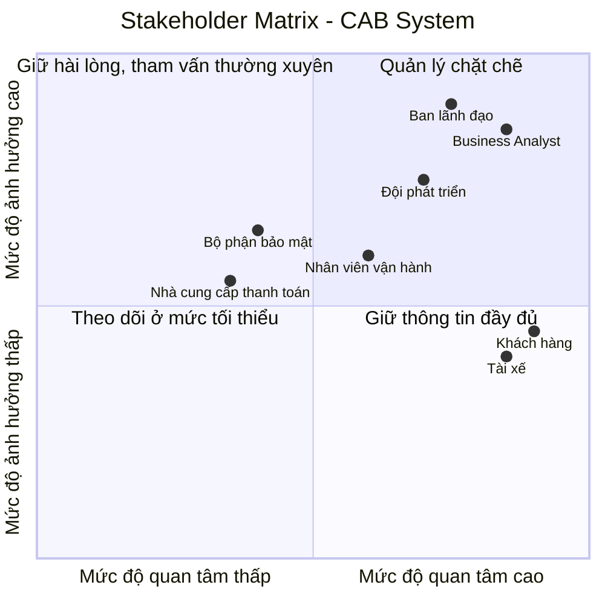
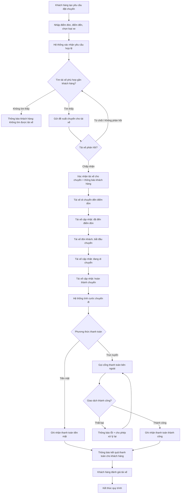
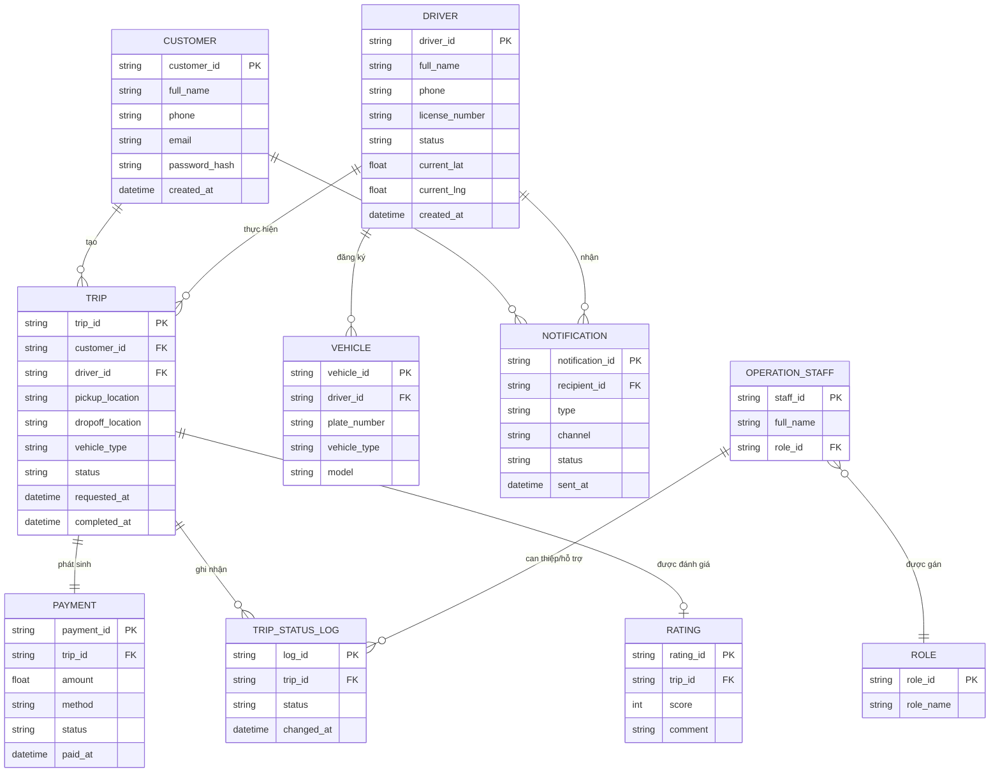
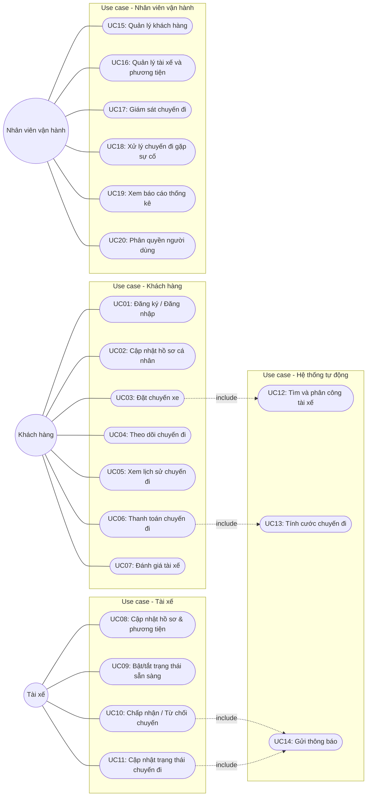

# SRS – Software Requirements Specification
## Dự án: CAB System – Nền tảng đặt xe trực tuyến (Công ty ABC)

| Thông tin | Nội dung |
|---|---|
| Khách hàng | Công ty ABC |
| Thời gian triển khai | 7 tuần |
| Loại tài liệu | Software Requirements Specification (SRS) |
| Người thực hiện | *(điền tên bạn / nhóm)* |
| Môn học | Lập trình hướng dịch vụ |
| Phiên bản | v1.0 |
| Ngày cập nhật | *(điền ngày nộp)* |

> Tài liệu này được xây dựng theo quy trình phân tích yêu cầu 12 bước, dựa trên tài liệu **"Yêu cầu của khách hàng – Dự án CAB System"** do khách hàng cung cấp.

---

## Mục lục
1. [Bước 1: Phân tích yêu cầu ban đầu](#bước-1-phân-tích-yêu-cầu-ban-đầu-business-contact)
2. [Bước 2: Xác định Stakeholders](#bước-2-xác-định-stakeholders)
3. [Bước 3: Business Goals (BG)](#bước-3-business-goals-bg)
4. [Bước 4: Phạm vi dự án (Scope)](#bước-4-phạm-vi-dự-án-scope)
5. [Bước 5: Business Requirements (BR)](#bước-5-business-requirements-br)
6. [Bước 6: Business Process (BP)](#bước-6-business-process-bp)
7. [Bước 7: Functional Requirements (FR)](#bước-7-functional-requirements-fr)
8. [Bước 8: Business Rules & Exceptions](#bước-8-business-rules--exceptions)
9. [Bước 9: Data Modeling (ERD)](#bước-9-data-modeling-erd)
10. [Bước 10: Non-Functional Requirements (NFR)](#bước-10-non-functional-requirements-nfr)
11. [Bước 11: Use Case Diagram](#bước-11-use-case-diagram)
12. [Bước 12: Đặc tả Use Case](#bước-12-đặc-tả-use-case-use-case-specification)
13. [Bước 13: Tiêu chí chấp nhận (Acceptance Criteria)](#bước-13-tiêu-chí-chấp-nhận-acceptance-criteria-ac)
14. [Các vấn đề cần làm rõ với khách hàng](#các-vấn-đề-cần-làm-rõ-với-khách-hàng-open-issues)

---

## Bước 1: Phân tích yêu cầu ban đầu (Business Contact)

**Bối cảnh:** Công ty ABC là doanh nghiệp cung cấp dịch vụ đặt xe trực tuyến. Hệ thống hiện tại (tổng đài + ứng dụng đơn giản) có nhiều hạn chế:

- Phân công tài xế chủ yếu **thủ công**.
- Khách hàng **khó theo dõi** trạng thái chuyến đi.
- Thông tin thanh toán **chưa được quản lý tập trung**.
- Bộ phận vận hành **khó mở rộng** hệ thống khi tăng trưởng.

**Mục tiêu kinh doanh cấp cao:** Xây dựng nền tảng CAB mới, phục vụ được số lượng lớn khách hàng và tài xế, có kiến trúc đủ linh hoạt để mở rộng tính năng trong tương lai mà không phải xây dựng lại toàn bộ hệ thống (đây là lý do môn học tiếp cận theo **kiến trúc hướng dịch vụ**).

**Ai sử dụng hệ thống (3 nhóm tác nhân chính):**

| Nhóm | Vai trò sử dụng chính |
|---|---|
| Khách hàng (Customer) | Đặt chuyến, theo dõi chuyến đi, thanh toán, đánh giá tài xế |
| Tài xế (Driver) | Nhận/thực hiện chuyến, cập nhật trạng thái, cập nhật vị trí |
| Nhân viên vận hành (Operation Staff) | Quản trị dữ liệu, giám sát vận hành, xử lý sự cố, xem báo cáo |

**Ai tham gia dự án (không trực tiếp dùng hệ thống hằng ngày nhưng ảnh hưởng/ra quyết định):** Ban lãnh đạo công ty ABC, Business Analyst, đội phát triển, nhà cung cấp thanh toán bên ngoài (third-party payment provider).

---

## Bước 2: Xác định Stakeholders

### 2.1 Danh sách Stakeholders

| Stakeholder | Vai trò |
|---|---|
| Ban lãnh đạo Công ty ABC | Phê duyệt phạm vi, ngân sách; nhận báo cáo doanh thu, hiệu suất vận hành |
| Khách hàng (Customer) | Người dùng cuối, đặt và sử dụng dịch vụ đi lại |
| Tài xế (Driver) | Người dùng cuối, cung cấp dịch vụ vận chuyển |
| Nhân viên vận hành (Operation Staff) | Quản trị, giám sát, hỗ trợ xử lý sự cố vận hành |
| Business Analyst | Làm rõ yêu cầu, xác nhận các điểm còn chưa rõ với khách hàng |
| Đội phát triển (Dev Team) | Thiết kế, xây dựng, triển khai hệ thống |
| Nhà cung cấp thanh toán bên ngoài | Xử lý giao dịch thanh toán điện tử, không lưu thông tin nhạy cảm trong hệ thống CAB |
| Bộ phận bảo mật / vận hành hệ thống | Đảm bảo xác thực, phân quyền, lưu vết thao tác quan trọng |

### 2.2 Stakeholder Matrix (Mức độ ảnh hưởng – Mức độ quan tâm)

**Diễn giải nhanh:** Ban lãnh đạo và Business Analyst nằm ở nhóm ảnh hưởng cao – cần quản lý chặt chẽ, tham vấn liên tục. Khách hàng và Tài xế có mức quan tâm rất cao (trải nghiệm trực tiếp) nhưng ảnh hưởng lên quyết định kỹ thuật thấp hơn – cần giữ thông tin đầy đủ, thu thập phản hồi thường xuyên.

---

## Bước 3: Business Goals (BG)

| Mã | Mục tiêu nghiệp vụ |
|---|---|
| BG01 | Tự động hóa việc tìm và phân công tài xế thay vì thực hiện thủ công |
| BG02 | Cho phép khách hàng thanh toán bằng tiền mặt hoặc trực tuyến |
| BG03 | Cho phép khách hàng theo dõi trạng thái chuyến đi theo thời gian thực |
| BG04 | Quản lý tập trung thông tin thanh toán và lịch sử giao dịch |
| BG05 | Xây dựng kiến trúc có khả năng mở rộng độc lập theo từng thành phần khi tải tăng |
| BG06 | Cung cấp báo cáo vận hành cho ban lãnh đạo (số chuyến, doanh thu, tỷ lệ hoàn thành/hủy, hiệu suất tài xế) |
| BG07 | Đảm bảo xác thực người dùng và phân quyền cho các thao tác quản trị nhạy cảm |
| BG08 | Cho phép mở rộng thêm loại dịch vụ, phương thức thanh toán, kênh thông báo trong tương lai mà không phải xây dựng lại toàn bộ hệ thống |

---

## Bước 4: Phạm vi dự án (Scope)

### Trong phạm vi (In-scope) – các module MVP

1. **Quản lý tài khoản & xác thực** (khách hàng, tài xế, nhân viên vận hành)
2. **Quản lý hồ sơ khách hàng**
3. **Quản lý hồ sơ & phương tiện tài xế**
4. **Đặt chuyến xe** (điểm đón, điểm đến, loại xe)
5. **Tìm và phân công tài xế** (matching)
6. **Theo dõi trạng thái chuyến đi**
7. **Tính cước chuyến đi**
8. **Thanh toán** (tiền mặt / trực tuyến qua nhà cung cấp bên ngoài)
9. **Thông báo** (customer & driver)
10. **Quản trị vận hành** (quản lý khách hàng, tài xế, phương tiện, chuyến đi)
11. **Phân quyền chức năng quản trị**
12. **Báo cáo thống kê vận hành**
13. **Đánh giá tài xế sau chuyến**

### Ngoài phạm vi / cần làm rõ thêm (Out-of-scope hoặc TBD trong 7 tuần đầu)

- Công thức tính cước chi tiết theo từng loại dịch vụ
- Chính sách hủy chuyến chi tiết (phí hủy, thời điểm được phép hủy...)
- Thời gian tối đa tài xế phải phản hồi một yêu cầu chuyến
- Cơ chế xử lý khi mất kết nối mạng (khách hàng hoặc tài xế)
- Thời gian lưu trữ dữ liệu (data retention policy)
- Lựa chọn kỹ thuật cụ thể của nhà cung cấp thanh toán
- Các loại dịch vụ đặt xe mới ngoài dịch vụ cơ bản ban đầu

> Các mục "TBD" ở trên được liệt kê lại chi tiết ở mục [Các vấn đề cần làm rõ với khách hàng](#các-vấn-đề-cần-làm-rõ-với-khách-hàng-open-issues).

---

## Bước 5: Business Requirements (BR)

| Mã | Tên | Diễn giải |
|---|---|---|
| BR01 | Đăng ký & xác thực tài khoản | Khách hàng và tài xế đăng ký/đăng nhập; tài xế có thể được nhân viên vận hành tạo tài khoản |
| BR02 | Quản lý hồ sơ cá nhân & phương tiện | Cập nhật thông tin cá nhân (khách hàng), hồ sơ và phương tiện (tài xế) |
| BR03 | Đặt chuyến xe | Khách hàng nhập điểm đón, điểm đến, chọn loại xe và gửi yêu cầu đặt xe |
| BR04 | Tìm và phân công tài xế | Hệ thống tự động xác định, đề xuất tài xế phù hợp dựa trên vị trí và trạng thái sẵn sàng |
| BR05 | Theo dõi trạng thái chuyến đi | Khách hàng và tài xế theo dõi/cập nhật trạng thái chuyến theo thời gian thực |
| BR06 | Tính cước và thanh toán chuyến đi | Xác định số tiền phải trả, hỗ trợ thanh toán tiền mặt hoặc trực tuyến |
| BR07 | Thông báo | Gửi thông báo cho khách hàng và tài xế theo các mốc sự kiện của chuyến đi |
| BR08 | Quản trị vận hành | Nhân viên vận hành quản lý khách hàng, tài xế, phương tiện, chuyến đi |
| BR09 | Phân quyền truy cập | Giới hạn các thao tác quản trị nhạy cảm chỉ dành cho nhân viên được phân quyền |
| BR10 | Báo cáo thống kê vận hành | Cung cấp báo cáo số chuyến, doanh thu, tỷ lệ hoàn thành/hủy, hiệu suất tài xế |
| BR11 | Đánh giá tài xế | Khách hàng đánh giá tài xế sau khi hoàn thành chuyến |

---

## Bước 6: Business Process (BP)

**BP01 – Quy trình đặt chuyến, tìm tài xế và thanh toán (quy trình chính):**

**Ghi chú nghiệp vụ:** Khi tài xế đầu tiên từ chối hoặc không phản hồi, hệ thống **quay lại bước tìm tài xế khác** mà **không yêu cầu khách hàng tạo lại yêu cầu** — đây là điểm quan trọng khách hàng nhấn mạnh trong tài liệu gốc.

---

## Bước 7: Functional Requirements (FR)

*(phân rã từ các Business Requirements ở Bước 5)*

| BR liên quan | Mã FR | Mô tả |
|---|---|---|
| BR01 | FR01 | Khách hàng đăng ký tài khoản bằng số điện thoại/email |
| BR01 | FR02 | Khách hàng/tài xế đăng nhập vào hệ thống |
| BR01 | FR03 | Nhân viên vận hành tạo tài khoản cho tài xế |
| BR02 | FR04 | Khách hàng cập nhật thông tin cá nhân |
| BR02 | FR05 | Tài xế cập nhật hồ sơ và thông tin phương tiện |
| BR02 | FR06 | Tài xế chuyển đổi trạng thái sẵn sàng nhận chuyến / ngừng hoạt động |
| BR03 | FR07 | Khách hàng nhập điểm đón và điểm đến |
| BR03 | FR08 | Khách hàng chọn loại xe |
| BR03 | FR09 | Khách hàng gửi yêu cầu đặt xe |
| BR04 | FR10 | Hệ thống xác định danh sách tài xế phù hợp theo vị trí và trạng thái sẵn sàng |
| BR04 | FR11 | Hệ thống gửi đề xuất chuyến cho tài xế phù hợp nhất |
| BR04 | FR12 | Hệ thống tự động tìm tài xế kế tiếp khi tài xế trước từ chối/không phản hồi |
| BR04 | FR13 | Hệ thống thông báo khách hàng khi không tìm được tài xế |
| BR05 | FR14 | Khách hàng xem trạng thái hiện tại của chuyến đi (đang tìm tài xế/đã nhận/đang đến/đang di chuyển...) |
| BR05 | FR15 | Tài xế cập nhật trạng thái chuyến đi (đã đến điểm đón, đã đón khách, đang di chuyển, hoàn thành) |
| BR05 | FR16 | Hệ thống lưu vị trí tài xế theo thời gian thực để phục vụ matching và ước tính thời gian đến |
| BR06 | FR17 | Hệ thống tính số tiền phải trả dựa trên loại dịch vụ và thông tin chuyến đi |
| BR06 | FR18 | Khách hàng chọn phương thức thanh toán (tiền mặt / trực tuyến) |
| BR06 | FR19 | Hệ thống gọi cổng thanh toán bên ngoài xử lý giao dịch trực tuyến |
| BR06 | FR20 | Hệ thống thông báo và cho phép xử lý lại khi giao dịch trực tuyến thất bại |
| BR07 | FR21 | Hệ thống gửi thông báo cho khách hàng theo các mốc sự kiện (tiếp nhận, nhận tài xế, tài xế đến, hoàn thành, kết quả thanh toán) |
| BR07 | FR22 | Hệ thống gửi thông báo cho tài xế (chuyến mới, thay đổi liên quan đến chuyến đang thực hiện) |
| BR08 | FR23 | Nhân viên vận hành xem danh sách và trạng thái các chuyến đang diễn ra |
| BR08 | FR24 | Nhân viên vận hành quản lý (thêm/sửa/khóa) tài khoản khách hàng và tài xế |
| BR08 | FR25 | Nhân viên vận hành xử lý các chuyến gặp sự cố |
| BR08 | FR26 | Nhân viên vận hành tra cứu lịch sử giao dịch |
| BR09 | FR27 | Hệ thống phân quyền chức năng quản trị theo vai trò nhân viên |
| BR10 | FR28 | Hệ thống tạo báo cáo số lượng chuyến, doanh thu, tỷ lệ hoàn thành/hủy, hiệu suất tài xế |
| BR11 | FR29 | Khách hàng xem lịch sử chuyến đi đã thực hiện |
| BR11 | FR30 | Khách hàng đánh giá và nhận xét tài xế sau khi hoàn thành chuyến |

---

## Bước 8: Business Rules & Exceptions

| Mã | Loại | Nội dung |
|---|---|---|
| RULE01 | Business Rule | Một chuyến đi chỉ được xác nhận cho một tài xế tại một thời điểm |
| RULE02 | Business Rule | Tài xế chỉ nhận được đề xuất chuyến khi đang ở trạng thái "sẵn sàng" |
| RULE03 | Business Rule | Thông tin thanh toán nhạy cảm (thẻ, tài khoản) không được lưu trực tiếp trong hệ thống CAB |
| RULE04 | Business Rule | Các thao tác quản trị nhạy cảm chỉ được thực hiện bởi nhân viên có quyền phù hợp |
| RULE05 | Business Rule | Mọi thao tác quan trọng (thanh toán, thay đổi trạng thái chuyến, thao tác quản trị) phải được lưu vết (audit log) |
| EXC01 | Exception | **Tài xế tìm quá lâu không có phản hồi:** hệ thống cần có ngưỡng thời gian chờ, hết thời gian thì tự động chuyển sang tìm tài xế khác *(giá trị ngưỡng cụ thể — xem mục Open Issues)* |
| EXC02 | Exception | **Không tìm được tài xế nào phù hợp:** hệ thống thông báo rõ ràng cho khách hàng, không để yêu cầu treo vô thời hạn |
| EXC03 | Exception | **Giao dịch thanh toán trực tuyến thất bại:** hệ thống thông báo cho khách hàng và cho phép thử lại theo chính sách của doanh nghiệp |
| EXC04 | Exception | **Tài xế mất kết nối/không cập nhật vị trí trong khi thực hiện chuyến:** cần cơ chế xử lý *(xem mục Open Issues)* |
| EXC05 | Exception | **Khách hàng hủy chuyến sau khi tài xế đã nhận:** cần quy trình thông báo cho tài xế và ghi nhận trạng thái hủy |
| EXC06 | Exception | **Sự cố ở module thanh toán hoặc thông báo:** không được làm gián đoạn chức năng đặt xe cốt lõi (yêu cầu kiến trúc tách rời theo hướng dịch vụ) |

---

## Bước 9: Data Modeling (ERD)

---

## Bước 10: Non-Functional Requirements (NFR)

| Mã | Nhóm | Yêu cầu |
|---|---|---|
| NFR01 | Hiệu năng (Performance) | Hệ thống phải phản hồi nhanh trong quá trình tìm và phân công tài xế, kể cả vào giờ cao điểm |
| NFR02 | Độ sẵn sàng (Availability) | Lỗi ở module thanh toán hoặc thông báo không được làm ngừng hoạt động chức năng đặt xe cốt lõi |
| NFR03 | Khả năng mở rộng (Scalability) | Các thành phần hệ thống phải mở rộng được độc lập với nhau khi tải tăng |
| NFR04 | Khả năng triển khai (Deployability) | Chức năng mới có thể triển khai từng phần, hạn chế ảnh hưởng đến chức năng đang hoạt động |
| NFR05 | Bảo mật – Xác thực | Khách hàng và tài xế phải được xác thực trước khi dùng chức năng yêu cầu tài khoản |
| NFR06 | Bảo mật – Phân quyền | Thao tác quản trị phải được kiểm soát quyền truy cập theo vai trò |
| NFR07 | Bảo mật – Dữ liệu | Thông tin cá nhân, thông tin phương tiện, dữ liệu vị trí và dữ liệu giao dịch phải được bảo vệ |
| NFR08 | Tuân vết (Auditability) | Các thao tác quan trọng phải được lưu vết phục vụ kiểm tra khi có sự cố |
| NFR09 | Khả năng mở rộng nghiệp vụ (Extensibility) | Kiến trúc phải cho phép bổ sung loại dịch vụ mới, phương thức thanh toán mới, kênh thông báo mới mà không xây dựng lại toàn bộ hệ thống |
| NFR10 | Khả năng tích hợp (Integration) | Hệ thống phải tích hợp được với nhà cung cấp thanh toán bên ngoài mà không lưu dữ liệu thanh toán nhạy cảm |

---

## Bước 11: Use Case Diagram

**Bảng danh sách Use Case:**

| Mã | Tên use case | Tác nhân chính |
|---|---|---|
| UC01 | Đăng ký / Đăng nhập | Khách hàng |
| UC02 | Cập nhật hồ sơ cá nhân | Khách hàng |
| UC03 | Đặt chuyến xe | Khách hàng |
| UC04 | Theo dõi chuyến đi | Khách hàng |
| UC05 | Xem lịch sử chuyến đi | Khách hàng |
| UC06 | Thanh toán chuyến đi | Khách hàng |
| UC07 | Đánh giá tài xế | Khách hàng |
| UC08 | Cập nhật hồ sơ & phương tiện | Tài xế |
| UC09 | Bật/tắt trạng thái sẵn sàng | Tài xế |
| UC10 | Chấp nhận / Từ chối chuyến | Tài xế |
| UC11 | Cập nhật trạng thái chuyến đi | Tài xế |
| UC12 | Tìm và phân công tài xế | Hệ thống (tự động) |
| UC13 | Tính cước chuyến đi | Hệ thống (tự động) |
| UC14 | Gửi thông báo | Hệ thống (tự động) |
| UC15 | Quản lý khách hàng | Nhân viên vận hành |
| UC16 | Quản lý tài xế và phương tiện | Nhân viên vận hành |
| UC17 | Giám sát chuyến đi | Nhân viên vận hành |
| UC18 | Xử lý chuyến đi gặp sự cố | Nhân viên vận hành |
| UC19 | Xem báo cáo thống kê | Nhân viên vận hành |
| UC20 | Phân quyền người dùng | Nhân viên vận hành |

---

## Bước 12: Đặc tả Use Case (Use Case Specification)

### UC03 – Đặt chuyến xe

| Mục | Nội dung |
|---|---|
| Tác nhân | Khách hàng |
| Mô tả | Khách hàng tạo yêu cầu đặt xe bằng cách nhập điểm đón, điểm đến và loại xe |
| Tiền điều kiện | Khách hàng đã đăng nhập thành công |
| Hậu điều kiện | Yêu cầu chuyến đi được tạo và chuyển sang trạng thái "đang tìm tài xế" (kích hoạt UC12) |
| Luồng chính | 1. Khách hàng chọn điểm đón và điểm đến → 2. Khách hàng chọn loại xe → 3. Khách hàng xác nhận gửi yêu cầu → 4. Hệ thống tạo chuyến đi ở trạng thái "đang tìm tài xế" → 5. Hệ thống kích hoạt UC12 (Tìm và phân công tài xế) |
| Luồng ngoại lệ | Nếu thông tin điểm đón/điểm đến không hợp lệ, hệ thống báo lỗi và yêu cầu nhập lại (bước 1) |
| Business rule liên quan | RULE01 |

### UC12 – Tìm và phân công tài xế

| Mục | Nội dung |
|---|---|
| Tác nhân | Hệ thống (tự động), liên quan gián tiếp: Tài xế |
| Mô tả | Hệ thống tự động xác định và đề xuất tài xế phù hợp cho một chuyến đi mới |
| Tiền điều kiện | Chuyến đi đang ở trạng thái "đang tìm tài xế" |
| Hậu điều kiện | Chuyến đi được gán cho một tài xế đã chấp nhận, hoặc khách hàng được thông báo không tìm được tài xế |
| Luồng chính | 1. Hệ thống xác định danh sách tài xế đang "sẵn sàng" gần điểm đón → 2. Hệ thống chọn tài xế phù hợp nhất và gửi đề xuất (kích hoạt UC14) → 3. Tài xế chấp nhận (UC10) → 4. Hệ thống xác nhận chuyến, thông báo khách hàng |
| Luồng ngoại lệ | EXC01 – Tài xế không phản hồi trong thời gian quy định: hệ thống tự động chuyển sang đề xuất cho tài xế kế tiếp (quay lại bước 2). EXC02 – Không còn tài xế phù hợp: hệ thống thông báo khách hàng (kích hoạt UC14) và kết thúc |
| Business rule liên quan | RULE01, RULE02 |

### UC06 – Thanh toán chuyến đi

| Mục | Nội dung |
|---|---|
| Tác nhân | Khách hàng, hệ thống thanh toán bên ngoài |
| Mô tả | Sau khi chuyến đi hoàn thành, hệ thống tính cước và xử lý thanh toán theo phương thức khách hàng chọn |
| Tiền điều kiện | Chuyến đi đã ở trạng thái "hoàn thành" |
| Hậu điều kiện | Thanh toán được ghi nhận thành công và khách hàng nhận được thông báo kết quả |
| Luồng chính | 1. Hệ thống tính cước chuyến đi (UC13) → 2. Khách hàng chọn phương thức thanh toán → 3a. Nếu tiền mặt: hệ thống ghi nhận thanh toán → 3b. Nếu trực tuyến: hệ thống gọi cổng thanh toán bên ngoài → 4. Hệ thống ghi nhận kết quả và thông báo khách hàng (UC14) |
| Luồng ngoại lệ | EXC03 – Giao dịch trực tuyến thất bại: hệ thống thông báo lỗi và cho phép khách hàng thử lại |
| Business rule liên quan | RULE03 |

### UC17 – Giám sát chuyến đi

| Mục | Nội dung |
|---|---|
| Tác nhân | Nhân viên vận hành |
| Mô tả | Nhân viên vận hành xem danh sách các chuyến đang diễn ra và trạng thái tài xế để hỗ trợ khi cần |
| Tiền điều kiện | Nhân viên đã đăng nhập với quyền phù hợp |
| Hậu điều kiện | Nhân viên nắm được tình trạng vận hành hiện tại, có thể chuyển sang UC18 nếu phát hiện sự cố |
| Luồng chính | 1. Nhân viên mở màn hình giám sát → 2. Hệ thống hiển thị danh sách chuyến đang diễn ra kèm trạng thái tài xế → 3. Nhân viên có thể chọn một chuyến để xem chi tiết |
| Luồng ngoại lệ | Nếu phát hiện chuyến gặp sự cố (ví dụ tài xế mất kết nối – EXC04), nhân viên chuyển sang UC18 để xử lý |
| Business rule liên quan | RULE04, RULE05 |

---

## Bước 13: Tiêu chí chấp nhận (Acceptance Criteria - AC)

**Mục đích:** Với mỗi yêu cầu/use case, Acceptance Criteria (AC) là tập hợp các điều kiện cụ thể, có thể kiểm chứng được (testable), giúp đội phát triển và khách hàng cùng xác định **khi nào một yêu cầu được xem là hoàn thành và có thể nghiệm thu**. AC được viết theo cấu trúc **Given – When – Then** (Điều kiện đầu vào – Hành động – Kết quả mong đợi).

### 13.1 Nhóm Khách hàng

| Mã AC | UC liên quan | Tiêu chí chấp nhận (Given – When – Then) |
|---|---|---|
| AC01 | UC01 | Given khách hàng chưa có tài khoản, When điền đầy đủ thông tin hợp lệ và xác nhận đăng ký, Then tài khoản được tạo thành công và khách hàng đăng nhập được ngay sau đó |
| AC02 | UC01 | Given khách hàng nhập sai thông tin đăng nhập, When xác nhận đăng nhập, Then hệ thống báo lỗi rõ ràng và không cho phép truy cập vào các chức năng yêu cầu tài khoản |
| AC03 | UC03 | Given khách hàng đã đăng nhập, When nhập đầy đủ điểm đón, điểm đến, chọn loại xe và xác nhận đặt xe, Then hệ thống tạo yêu cầu chuyến ở trạng thái "đang tìm tài xế" |
| AC04 | UC03 | Given điểm đón hoặc điểm đến không hợp lệ (rỗng/không xác định được), When khách hàng xác nhận đặt xe, Then hệ thống từ chối yêu cầu và hiển thị thông báo lỗi cụ thể, không tạo chuyến đi |
| AC05 | UC04 | Given chuyến đi đang diễn ra, When trạng thái chuyến thay đổi (đã nhận tài xế/đang đến/đang di chuyển/hoàn thành), Then khách hàng thấy trạng thái mới nhất mà không cần thao tác tải lại thủ công |
| AC06 | UC06 | Given chuyến đi đã hoàn thành, When hệ thống tính cước, Then số tiền hiển thị đúng theo công thức tính cước đã được xác nhận với khách hàng |
| AC07 | UC06 | Given khách hàng chọn thanh toán trực tuyến và giao dịch thất bại, When hệ thống nhận phản hồi lỗi từ cổng thanh toán, Then khách hàng nhận thông báo lỗi và có thể thử lại mà không mất thông tin chuyến đi |
| AC08 | UC07 | Given chuyến đi đã hoàn thành và thanh toán thành công, When khách hàng gửi đánh giá, Then điểm đánh giá được lưu và gắn đúng với chuyến đi, tài xế tương ứng |

### 13.2 Nhóm Tài xế

| Mã AC | UC liên quan | Tiêu chí chấp nhận (Given – When – Then) |
|---|---|---|
| AC09 | UC09 | Given tài xế đang "sẵn sàng", When tài xế chuyển sang "ngừng hoạt động", Then hệ thống loại tài xế này khỏi danh sách được đề xuất cho chuyến mới ngay lập tức |
| AC10 | UC10 | Given tài xế nhận được đề xuất chuyến, When tài xế không phản hồi trong khoảng thời gian quy định, Then hệ thống tự động chuyển đề xuất sang tài xế kế tiếp mà khách hàng không phải tạo lại yêu cầu |
| AC11 | UC10 | Given tài xế từ chối một đề xuất chuyến, When hệ thống ghi nhận từ chối, Then chuyến đó không được đề xuất lại cho cùng tài xế này trong cùng một lần tìm kiếm |
| AC12 | UC11 | Given tài xế đang thực hiện chuyến, When tài xế cập nhật trạng thái, Then hệ thống chỉ chấp nhận cập nhật đúng thứ tự hợp lệ (không cho phép ví dụ "hoàn thành" khi chưa "đã đón khách") |

### 13.3 Nhóm hệ thống tự động

| Mã AC | UC liên quan | Tiêu chí chấp nhận (Given – When – Then) |
|---|---|---|
| AC13 | UC12 | Given có ít nhất một tài xế sẵn sàng gần điểm đón, When khách hàng gửi yêu cầu đặt xe, Then hệ thống đề xuất chuyến cho tài xế phù hợp nhất trong thời gian ngắn nhất |
| AC14 | UC12 | Given hệ thống đã thử đề xuất hết danh sách tài xế phù hợp mà không có ai chấp nhận, When quá trình tìm kiếm kết thúc, Then khách hàng nhận được thông báo rõ ràng "không tìm được tài xế" thay vì yêu cầu bị treo vô thời hạn |
| AC15 | UC13 | Given chuyến đi hoàn thành với đầy đủ dữ liệu quãng đường/thời gian, When hệ thống tính cước, Then kết quả phải nhất quán và có thể kiểm chứng lại được ở lần tính sau |
| AC16 | UC14 | Given một sự kiện quan trọng xảy ra (nhận tài xế, tài xế đến, hoàn thành, kết quả thanh toán), When sự kiện được ghi nhận, Then thông báo tương ứng được gửi đúng người nhận trong thời gian hợp lý |
| AC17 | UC14 | Given module thông báo gặp sự cố, When lỗi xảy ra, Then các luồng nghiệp vụ cốt lõi (đặt xe, tìm tài xế, thanh toán) vẫn hoạt động bình thường, không bị phụ thuộc cứng vào module thông báo |

### 13.4 Nhóm Nhân viên vận hành

| Mã AC | UC liên quan | Tiêu chí chấp nhận (Given – When – Then) |
|---|---|---|
| AC18 | UC17 | Given có chuyến đang diễn ra, When nhân viên vận hành mở màn hình giám sát, Then danh sách hiển thị đầy đủ và đúng trạng thái thời gian thực của từng chuyến |
| AC19 | UC18 | Given một chuyến gặp sự cố (ví dụ tài xế mất kết nối), When nhân viên can thiệp xử lý, Then thao tác xử lý được ghi log và trạng thái chuyến được cập nhật phản ánh đúng thực tế |
| AC20 | UC19 | Given có dữ liệu chuyến đi trong khoảng thời gian được chọn, When xem báo cáo, Then số liệu (số chuyến, doanh thu, tỷ lệ hoàn thành/hủy, hiệu suất tài xế) khớp với dữ liệu giao dịch gốc |
| AC21 | UC20 | Given một nhân viên không có quyền thực hiện thao tác nhạy cảm, When nhân viên đó cố thực hiện thao tác đó, Then hệ thống từ chối thao tác và ghi log lại lần thử truy cập |

---

## Các vấn đề cần làm rõ với khách hàng (Open Issues)

Theo tài liệu yêu cầu gốc, doanh nghiệp **chưa chốt** các nội dung sau — Business Analyst cần làm rõ với các bên liên quan trước khi đội phát triển thiết kế chi tiết:

| # | Vấn đề cần làm rõ |
|---|---|
| 1 | Công thức/cách tính cước cụ thể theo từng loại dịch vụ |
| 2 | Tiêu chí ưu tiên tài xế khi có nhiều tài xế phù hợp (khoảng cách, đánh giá, thời gian chờ...) |
| 3 | Thời gian tối đa tài xế phải phản hồi một đề xuất chuyến trước khi hệ thống chuyển sang tài xế khác |
| 4 | Chính sách hủy chuyến (phí hủy, thời điểm được phép hủy, ai được hủy) |
| 5 | Cách xử lý khi khách hàng hoặc tài xế mất kết nối mạng trong khi chuyến đang diễn ra |
| 6 | Thời gian lưu trữ dữ liệu (lịch sử chuyến đi, dữ liệu vị trí, giao dịch...) |
| 7 | Nhà cung cấp thanh toán cụ thể sẽ tích hợp và các ràng buộc kỹ thuật đi kèm |
| 8 | Danh sách kênh thông báo dự kiến mở rộng trong tương lai (SMS, email, push notification...) |

---

*Tài liệu này là bản phân tích yêu cầu ban đầu (SRS), sẽ được cập nhật khi có thêm thông tin làm rõ từ khách hàng.*
