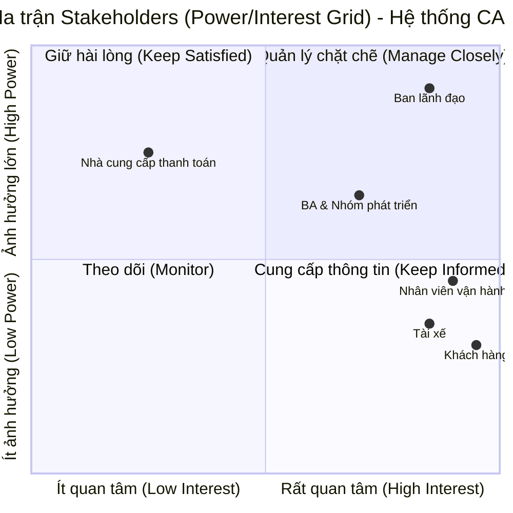

BƯỚC 1: đọc và phân tích yêu cầu ban đầu của KH ở giai đoạn sơ khởi  business contact 

---

---

## 1. Bối cảnh nghiệp vụ (Business Context)

### 1.1. Hiện trạng hệ thống (As-Is)

Công ty ABC hiện là một doanh nghiệp đang hoạt động trong lĩnh vực cung cấp dịch vụ đặt xe trực tuyến. Ở thời điểm hiện tại, quy trình đặt xe của khách hàng đang được xử lý thông qua hai kênh chính là liên hệ trực tiếp với tổng đài hoặc thông qua một ứng dụng cơ bản.

### 1.2. Các vấn đề đang gặp phải (Pain Points)

Hệ thống và quy trình vận hành hiện tại đang bộc lộ nhiều điểm hạn chế, cụ thể:

* **Vận hành kém hiệu quả:** Việc phân công tài xế chủ yếu vẫn đang được thực hiện thủ công.

* **Trải nghiệm khách hàng thấp:** Khách hàng gặp khó khăn trong việc theo dõi trạng thái chuyến đi của mình.

* **Quản lý rời rạc:** Dữ liệu và thông tin thanh toán chưa được quản lý một cách tập trung.

* **Rào cản kỹ thuật:** Bộ phận vận hành đang gặp rất nhiều khó khăn khi có nhu cầu mở rộng quy mô hệ thống.

### 1.3. Mục tiêu kinh doanh (Business Objectives / To-Be)

Để giải quyết các rào cản trên, ban lãnh đạo công ty ABC quyết định đầu tư xây dựng dự án hệ thống **CAB System** mới với thời gian triển khai dự kiến là 7 tuần. Mục tiêu cốt lõi của nền tảng mới bao gồm:

* **Nâng cao năng lực phục vụ:** Hệ thống phải có khả năng đáp ứng và phục vụ số lượng lớn khách hàng cùng tài xế, hoạt động ổn định ngay cả vào các thời điểm nhu cầu tăng cao.

* **Tự động hóa và minh bạch:** Xử lý luồng đặt xe tự động (tìm kiếm, phân công) và cho phép người dùng theo dõi toàn bộ trạng thái chuyến đi.

* **Kiến trúc linh hoạt:** Hệ thống không được sụp đổ toàn bộ nếu có một lỗi xảy ra ở chức năng thanh toán hay thông báo. Đồng thời, kiến trúc phải đủ linh hoạt để trong tương lai có thể bổ sung dịch vụ mới, thêm phương thức thanh toán hoặc các kênh thông báo mà không phải đập bỏ xây lại.

---

---

BƯỚC 2: xác định những stakeholders (lọc ra bảng gồm 2 cột, cột thứ nhất gồm tên stakeholders, cột thứ 2 là vai trò của nó) phần 2 là vẽ ma trận stakeholder matrix (ma trận này sẽ cho chúng ta biết tầm ảnh hưởng quan trọng của stakeholders trong hệ thống - dùng công cụ mermaid để vẽ các sơ đồ trong markdown)

### 1. Bảng xác định Stakeholders và Vai trò

Dựa vào yêu cầu ban đầu của doanh nghiệp, chúng ta có thể xác định các bên liên quan và vai trò của họ như sau:

| Tên Stakeholders | Vai trò |
| --- | --- |
| **Ban lãnh đạo / Ban giám đốc** | Là người tài trợ và đưa ra quyết định, mong muốn xây dựng nền tảng CAB mới có khả năng phục vụ số lượng lớn người dùng và có thể phát triển thêm tính năng trong tương lai.

 |
| **Khách hàng** | Là một trong ba nhóm người dùng chính, trực tiếp sử dụng ứng dụng để gửi yêu cầu đặt xe, theo dõi chuyến đi, thanh toán và đánh giá tài xế.

 |
| **Tài xế** | Là nhóm người dùng chính, sử dụng hệ thống để nhận thông báo chuyến, chấp nhận/từ chối, cập nhật trạng thái di chuyển và cung cấp dịch vụ vận chuyển.

 |
| **Nhân viên vận hành** | Là nhóm người dùng chính sử dụng giao diện quản trị để quản lý khách hàng, tài xế, chuyến đi, hỗ trợ xử lý chuyến bị lỗi và xem các báo cáo hiệu quả hoạt động.

 |
| **Business Analyst (BA)** | Người chịu trách nhiệm phân tích, xác định rõ phạm vi, tác nhân, quy trình nghiệp vụ và làm rõ các vấn đề còn chưa rõ với các bên liên quan.

 |
| **Nhóm phát triển** | Đội ngũ chịu trách nhiệm xây dựng giải pháp phần mềm dựa trên các yêu cầu đã được BA phân tích và chốt với khách hàng.

 |
| **Nhà cung cấp thanh toán bên ngoài** | Đối tác thứ ba được hệ thống tích hợp để xử lý các giao dịch thanh toán điện tử của khách hàng.

 |

---

### 2. Ma trận Stakeholder (Power/Interest Grid)

Ma trận này giúp định hình chiến lược giao tiếp và quản lý kỳ vọng. Các Stakeholder được phân loại dựa trên 2 trục: **Tầm ảnh hưởng (Power)** đến quyết định của dự án và **Sự quan tâm (Interest)** đối với kết quả của dự án.

Dưới đây là mã Mermaid để tạo biểu đồ Quadrant Chart (Ma trận phần tư). Khi dán vào GitHub Markdown, nó sẽ tự động render thành biểu đồ:

**Giải thích chiến lược quản lý dựa trên ma trận:**

1. **Góc phần tư 1 - Quản lý chặt chẽ (High Power, High Interest):**
* **Ban lãnh đạo:** Đây là nhóm tài trợ tiền và ra quyết định. BA cần liên tục báo cáo tiến độ, xin phê duyệt các yêu cầu và đảm bảo hệ thống đi đúng định hướng chiến lược.
* **BA & Nhóm phát triển:** Nhóm nòng cốt trực tiếp thiết kế và xây dựng, có ảnh hưởng lớn đến sự thành bại của giải pháp.

2. **Góc phần tư 2 - Giữ hài lòng (High Power, Low Interest):**
* **Nhà cung cấp thanh toán bên ngoài:** Họ không quan tâm đến nội bộ ứng dụng CAB vận hành ra sao, nhưng nếu API thanh toán của họ thay đổi hoặc gặp sự cố thì dự án bị ảnh hưởng rất nặng. Cần duy trì kênh liên lạc kỹ thuật để đảm bảo tích hợp thông suốt.

3. **Góc phần tư 4 - Cung cấp thông tin (Low Power, High Interest):**
* **Khách hàng, Tài xế, Nhân viên vận hành:** Đây là những người trực tiếp sử dụng hệ thống. Họ rất quan tâm vì ứng dụng ảnh hưởng đến công việc và tiện ích hàng ngày của họ. Tuy nhiên, họ không có quyền quyết định cấp vốn hay thay đổi phạm vi lõi của dự án. Cần khảo sát, lấy ý kiến (Requirement Gathering) và cung cấp tài liệu hướng dẫn sử dụng kỹ lưỡng. Mọi sự thay đổi trên ứng dụng đều phải thông báo trước cho nhóm này.
